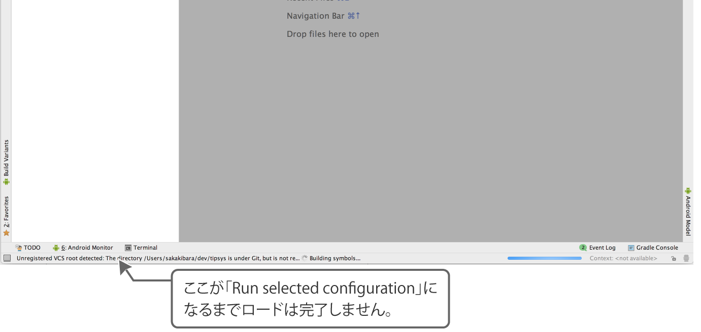

# Ionic Frameworkでつくる モバイルアプリ開発入門
書籍[「Ionicで作る モバイルアプリ制作入門〈Web/iPhone/Android対応〉](http://amzn.to/2mstNnh)」のサポートページです。著者と[Ionic Japan User Group](https://t.co/K9slM8tvi8)にて運営を行っております。

## サポートチャンネル
Ionic Japan User Groupのslack #ionic-handbook でサポートを行っております。なぜかうまく動かない、よくわからない、ということありましたら挫折する前にぜひご利用くださいませー。

[Ionic Japan User Groupのslack](https://t.co/K9slM8tvi8)

## チュートリアル
本書のチュートリアルは、以下のレポジトリでステップ別に公開しています。なぜか動かない時などにご利用下さい。
- [チュートリアル「タスクリストアプリをつくってみよう」](https://github.com/Ionic-jp/ionic-tutorial)
- [チュートリアル「WordPressを表示するアプリをつくろう」](https://github.com/Ionic-jp/wp-tutorial)
- [チュートリアル「コードリファクタリング」](https://github.com/Ionic-jp/rf-tutorial)
- [チュートリアル「スマホアプリの機能をつけよう」](https://github.com/Ionic-jp/native-tutorial)

## スマホでの実行がうまくいかない場合
### Xcodeがうまくいかない方
#### `io.ionic.starter ~` とエラーがでる場合
P44 の最終行で案内していますように「io.ionic.starter」 と設定されている `Bundle identifier`を変更してください。同一IDで実行している人がいてエラーがでているので、`starter`を適当な文字列に変更すればOKです。

### Android Studioがうまくいかない方
#### ▶ が有効にならない
多くの場合はファイル読み込みに時間がかかっています。最下部のバーが`Run selected configuration`になるまでお待ち下さい。



#### エミュレーターが選択できない
Android Studioインストール直後は、バーチャルデバイスデータがないのでダウンロードする必要があります。▶をクリックして起動したモーダル右下の「Create New Vitual Device」を選択して起動したいバーチャルデバイスを選択し、バーチャルデバイスデータをDLしてください（時間がかかります）

## 本書での誤字・誤植
誤字・誤植についてご案内いたします。「間違った記述もしくはチュートリアルを進めることができないもの」は *致命的な誤字誤植* 、 そうでないものを *その他の誤字誤植* として案内しております。

### 致命的な誤字誤植
- 現在ありません

### その他の誤字誤植
CHAPTER05で誤字誤植がございます。大変申し訳ございません。なお、作業行には影響ありませんので、チュートリアルは問題なく進めていただくことができます。

#### CHAPTER05

##### P110 中部 SAMPLE CODE `src/pages/home/home.ts`
`constructor` で呼び出していたモジュール名が間違って表記されている。

```
  public http: Http,  =>  public http: HttpClient,
```


##### P119 下部 SAMPLE CODE `src/pages/home/home.ts`
前の手順と `import` の呼び出し順が逆になって表記されている。

```
  import { IonicPage, NavController, LoadingController, Platform } from 'ionic-angular'; => 下
- import { HttpClient } from '@angular/common/http'; => 上
```


##### P122 下部 SAMPLE CODE `src/pages/home/home.ts`
前の手順で削除した `HttpClient` の表記が残っている / `Platform` の追加が消えている

```
import { HttpClient } from '@angular/common/http'; => 削除
import { IonicPage, NavController, LoadingController, Platform } from 'ionic-angular'; => Platformの追加
```

##### P123 中部 SAMPLE CODE `src/pages/article/article.ts`
前の手順で削除した `HttpClient` の表記が残っている

```
import { HttpClient } from '@angular/common/http'; => 削除
```
